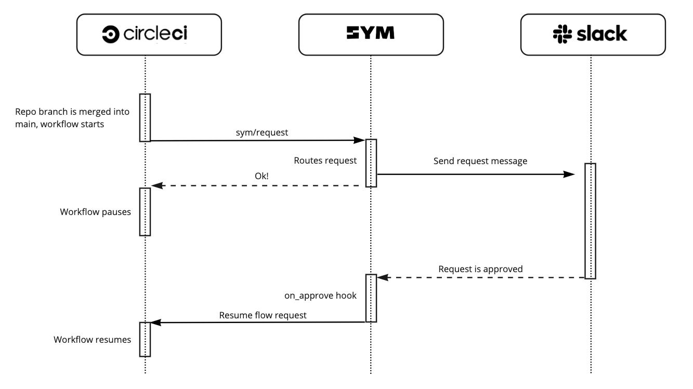

# Approving a CircleCI Job with Sym
This section illustrates how to use the [Sym Orb](https://circleci.com/developer/orbs/orb/sym/sym) in your CircleCI pipeline and how to approve a CircleCI job with hooks

## Tutorial

Check out a step-by-step tutorial [here](https://docs.symops.com/docs/circleci-and-sym).

# Sequence diagram of the approval process



## Gating a CircleCI job with a Sym Approval

This approval flow will be triggered by the `sym/request` job in your CircleCI workflow.
Once approved, Sym will automatically resume the workflow after the `wait_for_sym_approval` job.

```yaml
# Add the Sym orb to your config.yml
orbs:
  sym: sym/sym@1.1

jobs:
  prod-deploy:
    docker:
      - image: cimg/base:stable
    steps:
      - run:
          command: echo "Deploying to prod"

workflows:
  sym-approval-example:
    jobs:
      - sym/request:
          flow_srn: "healthy-health:flow:approval-ci-deploy-prod:latest"
          flow_inputs: '{
                          "build_url": "${CIRCLE_BUILD_URL}",
                          "workflow_id": "${CIRCLE_WORKFLOW_ID}"
                        }'
          request_slug: "prod-deploy"
      - wait_for_sym_approval:
          type: approval
          requires:
            - sym/request
      - sym/validate:
          request_slug: "prod-deploy"
          requires:
            - wait_for_sym_approval
      - prod-deploy:
          requires:
            - sym/validate
```

For more information of the Sym CircleCI orb, please check out [our docs](https://circleci.com/developer/orbs/orb/sym/sym).

## About Sym

This workflow is just one example of how Sym Implementers use the [Sym SDK](https://docs.symops.com/docs) to create [Sym Flows](https://docs.symops.com/docs/sym-access-flows).
