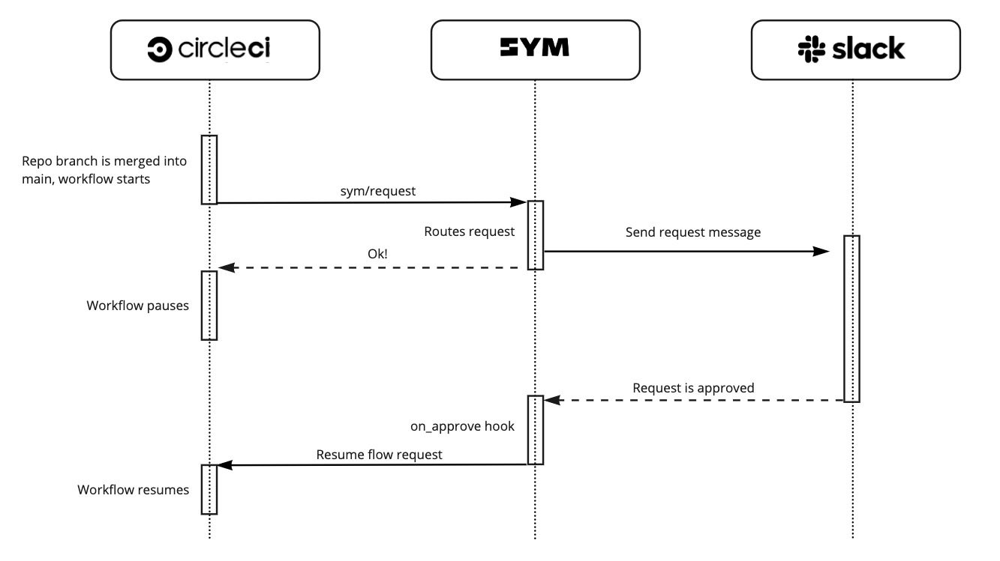

# Sym Approvals Quickstart

This is a starter template to get a Sym Deployment Approval Flow set up for your team.


# Sequence diagram of the approval process



## Gating a CircleCI step with a Sym Approval

This approval flow will get triggered once the `sym/request` step is reached in a CircleCI workflow. Once approved, Sym will resume the workflow from the `wait_for_sym_approval` step.


```yaml
# Add the Sym orb to your config.yml
orbs:
  sym: sym/sym@1.0.0

workflows:
  main:
    jobs:
      # This will start the Sym flow
      - sym/request:
          flow_srn: sym:flow:ci-approval-prod:latest
          flow_inputs: '{
                      "workflow_url": "${CIRCLE_BUILD_URL}",
                      "merging_user": "${CIRCLE_USERNAME}",
                      "workflow_id": "${CIRCLE_WORKFLOW_ID}"
                  }'
          requires:
            - terraform_acceptance_test
          context: sym-bot-token

      # Once approved, Sym will resume CircleCI flow from this step.
      - wait_for_sym_approval:
          type: approval
          requires:
            - sym/request

      # This is the step gated by Sym approval
      - deploy_prod:
          requires:
            - wait_for_sym_approval
          ...
```

For more information of the Sym CircleCI orb, please check out [our docs](https://circleci.com/developer/orbs/orb/sym/sym).

## About Sym

This workflow is just one example of how [Sym Implementers](https://docs.symops.com/docs/sym-for-implementers) use the [Sym SDK](https://docs.symops.com/docs) to create [Sym Flows](https://docs.symops.com/docs/flows).
